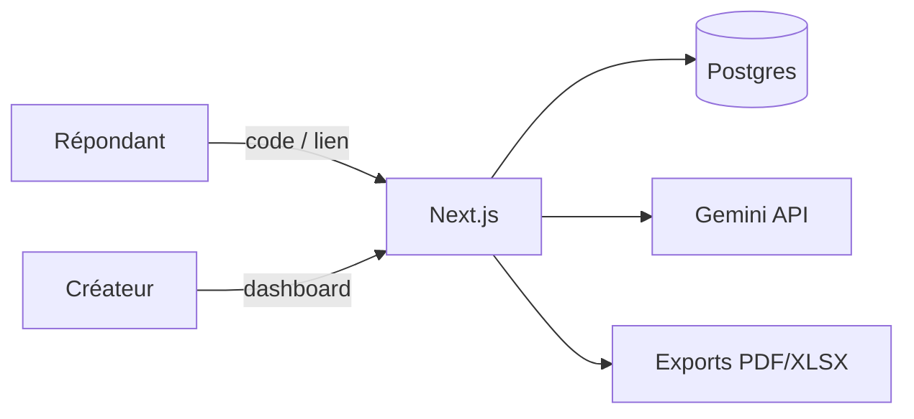

<div align="center">


# Sondage

**Plateforme de collecte & analyse de données pour enquêtes académiques et terrain.**

Créez des sondages, partagez un lien ou un code, visualisez les résultats en direct et exportez vos rapports — sans friction pour les répondants.

<br />

[](https://enquete-pi.vercel.app)
[](https://nextjs.org/)
[](https://www.typescriptlang.org/)
[](#)

<br />

[Français](#fonctionnalités) · [English](#english) · [Déploiement](#déploiement-vercel) · [Variables](#variables-denvironnement)

</div>

---

<table>
<tr>
<td width="68%" valign="top">

## Aperçu

| Rôle | Ce qu'il peut faire |
|------|---------------------|
| **Créateur** | Compte, wizard pas à pas, brouillons, publication, résultats sécurisés |
| **Répondant** | Répond via code ou lien — **aucun compte** requis |
| **Superadmin** | Statistiques plateforme, feedbacks utilisateurs, gestion globale |

> Démo en ligne : **[enquete-pi.vercel.app](https://enquete-pi.vercel.app)**

### Fonctionnalités

- **Assistant de création** — sondage vierge, questions variées (choix, note, texte…), champs obligatoires
- **Tableau de bord** — sondages publiés, brouillons, accès rapide aux résultats
- **Partage** — code court, lien direct, QR code
- **Analyse** — graphiques Recharts, exports CSV · Excel · PDF
- **Rapport IA** — synthèse rédigée via Google Gemini (fallback multi-modèles)
- **Feedback** — widget intégré, consultable par le superadmin
- **i18n** — interface FR / EN (`next-intl`)
- **Mobile-first** — navbar adaptive, menu bottom sheet, responsive complet

### Routes principales

| Route | Accès |
|-------|-------|
| `/fr` | Accueil |
| `/fr/inscription` · `/fr/connexion` | Compte créateur |
| `/fr/dashboard` | Espace utilisateur |
| `/fr/creer` | Wizard de création |
| `/fr/publie/[code]` | Partage (propriétaire) |
| `/fr/repondre/[code]` | Réponse (public) |
| `/fr/resultats/[code]` | Résultats (propriétaire) |
| `/fr/admin` | Superadmin |

### Démarrage local

```bash
git clone https://github.com/yongvic/enquete.git
cd enquete
npm install
cp .env.example .env
# Renseignez DATABASE_URL et AUTH_SECRET
npx prisma db push
npm run dev
```

→ [http://localhost:3000](http://localhost:3000) redirige vers `/fr`.

### Structure

```
app/[locale]/       Pages & routes i18n
components/         UI (wizard, graphiques, navbar, feedback…)
lib/actions/        Server Actions
lib/                Auth, exports, IA, stats
prisma/             Schéma Postgres & migrations SQL
messages/           Traductions FR / EN
public/             Logos & assets
```

</td>
<td width="32%" valign="top" align="center">

<br />

### Stack technique

<p align="center">
  <a href="https://nextjs.org"></a>
  <a href="https://react.dev"></a>
  <a href="https://www.typescriptlang.org"></a>
</p>
<p align="center">
  <a href="https://tailwindcss.com"></a>
  <a href="https://www.prisma.io"></a>
  <a href="https://www.postgresql.org"></a>
</p>
<p align="center">
  <a href="https://vercel.com"></a>
  <a href="https://eslint.org"></a>
</p>

<br />

| Couche | Outil |
|:--|:--|
| Framework | Next.js 15 App Router |
| UI | React 19 · Tailwind v4 |
| Data | Prisma · Neon Postgres |
| Auth | Auth.js v5 |
| Charts | Recharts |
| Exports | ExcelJS · jsPDF |
| IA | Google Gemini |
| Analytics | Vercel Analytics |

<br />

### Architecture



<br />

**Design** — typographie Georgia, palette encre & ocre, composants sobres.

</td>
</tr>
</table>

---

## Variables d'environnement

| Variable | Requis | Description |
|----------|:------:|-------------|
| `DATABASE_URL` | ✓ | URL Postgres (Neon / Vercel) |
| `AUTH_SECRET` | ✓ | Secret session Auth.js |
| `AUTH_URL` | ✓ | URL de l'application |
| `NEXT_PUBLIC_APP_URL` | ✓ | URL publique pour les liens de partage |
| `SUPERADMIN_EMAIL` | | Email du superadmin |
| `TEMPLATE_ACCESS_EMAIL` | | Accès template enquête réservé |
| `GEMINI_API_KEY` | | Clé API pour rapports IA |
| `GEMINI_MODELS` | | Liste de modèles (fallback) |
| `NEXT_PUBLIC_*` | | Liens footer & auteur |

Voir [`.env.example`](./.env.example) pour le modèle complet.

---

## SEO & référencement

- Metadata Open Graph / Twitter par page (`lib/seo.ts`)
- `sitemap.xml` et `robots.txt` générés automatiquement
- Manifest PWA (`/manifest.webmanifest`)
- Données structurées JSON-LD (Organization + WebApplication)
- Pages privées (dashboard, admin, résultats) en `noindex`
- Image de partage : `/promo/promo-linkedin.png`

Conseil : définissez `NEXT_PUBLIC_APP_URL` / `AUTH_URL` sur l’URL de production pour des canonicals corrects.

## Déploiement Vercel

1. Importez le dépôt sur [Vercel](https://vercel.com)
2. Créez une base **Postgres** (Neon) et liez `DATABASE_URL`
3. Ajoutez les variables d'environnement
4. Deploy — `prisma generate` s'exécute au build
5. Appliquez les migrations SQL si besoin (`prisma/migrate-*.sql`) via la console Neon

---

## English

**Sondage** is a Next.js survey platform for academic and field research: create surveys, share via link or code, analyze live results, export reports (CSV / Excel / PDF), and generate AI summaries. Respondents never need an account.

---

<div align="center">

<br />

**Conçu par [Young Vic](https://github.com/yongvic)**

[](https://github.com/yongvic/enquete)
[](https://www.linkedin.com/in/edo-yawo-sokpa-06617b333)

<br />

<sub>Enquêtes académiques · Collecte de terrain · Open source</sub>

</div>
